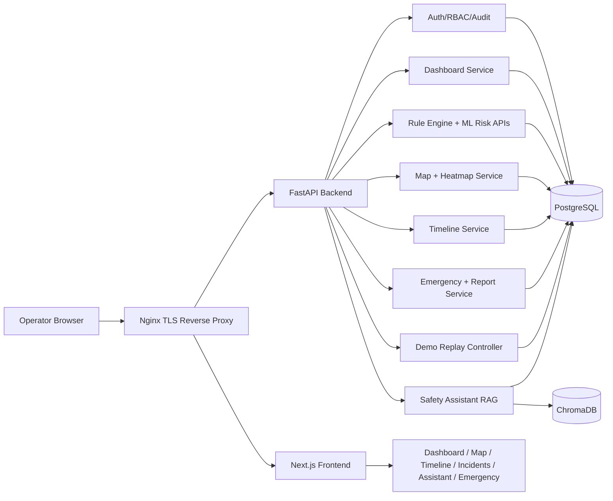

# SentinelAI

SentinelAI is an AI-powered industrial safety intelligence platform. It does not replace SCADA, IoT, CCTV, permit, or maintenance systems. It sits above them as the intelligence layer that answers a harder question: what does everything happening together actually mean?

The core philosophy is explainable compound risk detection. SentinelAI is designed to detect dangerous combinations of otherwise ordinary signals, such as gas rising plus maintenance active plus workers nearby, before a naive single-threshold alarm would fire. Every alert, risk score, timeline, assistant answer, and report is expected to cite the evidence that produced it.

## What Is Built

- FastAPI backend with JWT auth, RBAC, audit logging, dashboard aggregation, notifications, risk engine, RAG safety assistant, map/timeline services, emergency/report APIs, demo replay controller, and health endpoints.
- PostgreSQL schema and SQLAlchemy models for users, plants, workers, sensors, readings, equipment, permits, maintenance, alerts, incidents, risk assessments, documents, chat history, notifications, maps, and audit logs.
- ChromaDB-backed retrieval pipeline for cited safety assistant answers.
- Next.js frontend with dashboard, plant map, timeline, incidents, assistant, and emergency views.
- Docker Compose deployment with Nginx TLS reverse proxy, backend, frontend, Postgres, and ChromaDB.
- Deterministic synthetic dataset and unattended demo replay controller.

## Architecture



## Repository Layout

```text
backend/        FastAPI app, services, models, schemas, migrations, tests
frontend/       Next.js app router UI, components, React Query client
data/synthetic/ Deterministic demo dataset generator
infra/          Docker Compose and Nginx configuration
docs/           Architecture, deployment, QA, security, demo docs
```

## Local Run

Prerequisites:

- Docker Engine with Compose v2.
- Make.
- Ports 80 and 443 available, or change `NGINX_PORT` / `NGINX_TLS_PORT`.

Start from a fresh checkout:

```bash
cp .env.example .env
make bootstrap
```

Open:

```text
https://localhost
```

Health checks:

```bash
make ps
curl -k https://localhost/health
curl -k https://localhost/api/health
curl -k https://localhost/api/health/ready
```

## Run The Demo

Start or reset the deterministic demo replay:

```bash
curl -k -X POST https://localhost/api/demo/replay/start \
  -H "Content-Type: application/json" \
  -d '{"mode":"accelerated","speed_multiplier":600}'
```

Login:

- Email: `demo.admin@sentinelai.local`
- Password: `DemoPass123!`

Advance through the scripted flow:

```bash
curl -k -X POST https://localhost/api/demo/replay/advance \
  -H "Content-Type: application/json" \
  -d '{"step":5}'
```

For the full talk track, use [docs/demo-runbook.md](docs/demo-runbook.md).

## Tests And QA

Backend tests:

```bash
docker compose --env-file .env -f infra/docker-compose.yml run --rm backend pytest
```

Frontend checks:

```bash
cd frontend
npm run lint
npm run build
npm run test:e2e -- --list
```

The full Playwright e2e test requires the full stack running.

## Documentation

Start with [docs/index.md](docs/index.md).
