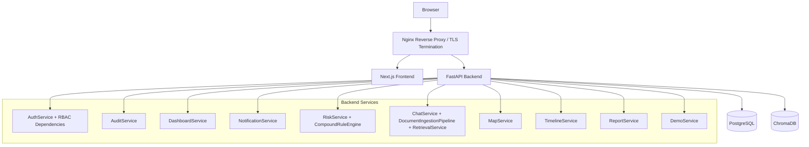

# SentinelAI Architecture

This document describes the system as currently built in this repository.

## Runtime View

## Frontend

The frontend is a Next.js App Router application in `frontend/`.

Implemented primary views:

- `app/dashboard`: command-center shell with risk score, alerts, telemetry charts, heatmap preview, timeline preview, recommendations, events, and emergency actions.
- `app/map`: Leaflet-based operational map consuming viewport layers and computed heatmap data.
- `app/timeline`: incident timeline view generated from backend evidence links.
- `app/incidents`: searchable/filterable incident history UI.
- `app/assistant`: retrieval-grounded safety assistant chat UI with visible citations.
- `app/emergency`: emergency response panel and report export controls.

Shared client utilities:

- `frontend/lib/api.ts`: API helper, including bearer token attachment from local storage.
- `frontend/lib/demo.ts`: demo replay status discovery for real plant/incident IDs.
- `frontend/lib/rbac.ts`: frontend role/access helpers.

The frontend communicates with the backend through Nginx using `NEXT_PUBLIC_API_BASE_URL` / `PUBLIC_API_BASE_URL`.

## Nginx / API Gateway

Nginx is configured in `infra/nginx/default.conf`.

Responsibilities:

- TLS termination.
- HTTP-to-HTTPS redirect except `/health`.
- Reverse proxy `/api/*` to FastAPI under `/api/v1/*`.
- Reverse proxy all other UI traffic to the Next.js frontend.
- Security headers: HSTS, CSP, X-Frame-Options, X-Content-Type-Options, Referrer-Policy, Permissions-Policy.

In Compose, only Nginx publishes host ports. Backend, frontend, Postgres, and ChromaDB are internal Docker-network services.

## Backend API Layer

FastAPI app factory: `backend/app/main.py`.

Routers:

- `auth.py`: login, refresh, logout.
- `health.py`: liveness and readiness.
- `dashboard.py`: single-call dashboard aggregation.
- `notifications.py`: in-app/email notification workflows.
- `risk.py`: compound rule evaluation, ML classification, telemetry prediction.
- `chat.py`: document ingestion, assistant query, incident explanation.
- `map.py`: plant layouts, hazards, viewport layers, alert markers.
- `timeline.py`: incident and alert timeline reconstruction.
- `incidents.py`: emergency panel, incident report, PDF/CSV export, report stubs.
- `demo.py`: deterministic demo replay controller and dashboard performance check.

Route handlers are intentionally thin. Business logic lives in services under `backend/app/services/`, rule/model logic under `backend/app/ml/`, and retrieval logic under `backend/app/rag/`.

## Backend Services

Service boundaries as implemented:

- `AuthService`: JWT access/refresh flow, refresh rotation, logout, auth audit logging.
- `AuditService`: centralized immutable audit-log writer.
- `DashboardService`: query-optimized aggregation for command-center summary.
- `NotificationService`: dashboard and email delivery, with SMS/Teams/Slack future-channel stubs.
- `RiskService`: orchestration for compound rules, classifier persistence, and trend prediction.
- `MapService`: plant layout metadata, hazard zones, marker layers, and inverse-distance heatmap cells.
- `TimelineService`: reconstruction of alert/incident timelines from stored evidence links.
- `ChatService`: retrieval-only assistant behavior, chat history persistence, citations.
- `ReportService`: emergency panel, incident report, CSV/PDF export.
- `DemoService`: deterministic Section 15 replay, seeded demo user, incident opening, performance check.

## Data Layer

PostgreSQL stores operational data and evidence chains.

Core model groups:

- Identity and RBAC: users, refresh tokens.
- Plant assets: plants, equipment, sensors, sensor readings, workers, worker location events.
- Work context: permits, maintenance activities.
- Safety outputs: alerts, incidents, risk assessments, notifications, reports via service output.
- Explainability: alert evidence links, incident evidence links, audit logs.
- RAG metadata: documents and chat history.
- Map layers: plant layouts and hazard zones.

Migrations live in `backend/alembic/versions/`.

Sensor readings use append-only time-series rows with indexes on `(sensor_id, measured_at)` and `(plant_id, measured_at)`. The current table is suitable for demo scale; high-retention pilot deployments should plan partitioning or TimescaleDB-style hypertables.

## AI And Risk Engine

Implemented AI/risk modules:

- `ml/rules_engine.py`: config-driven compound rule DSL and rolling-window evaluator.
- `ml/compound_rules.yaml`: gas + maintenance + workers, confined space + ventilation failure, high temperature + pressure increase.
- `ml/risk_classifier.py`: XGBoost primary with Random Forest/fallback behavior and model version recording.
- `ml/timeseries_predictor.py`: forward signal for gas, temperature, and pressure trends.
- `rag/*`: document chunking, deterministic embeddings, ChromaDB vector store adapter, retrieval service.

The RAG assistant is retrieval-only. It does not fine-tune a model and must return citations or explicitly state that it does not have enough information.

## Visualization Layer

Visualization is split between backend computation and frontend rendering:

- Backend computes dashboard aggregates, heatmap cells, alert marker positions, timelines, and emergency panel state.
- Frontend renders dense operational views using React Query polling, Apache ECharts, Leaflet, and controlled Framer Motion for state changes.

## Demo Flow

The deterministic flow is owned by:

- `data/synthetic/generator.py`: source synthetic day.
- `backend/app/services/demo_service.py`: replay state, seeded user, alert/incident creation.
- `backend/app/api/demo.py`: replay control API.
- `frontend/tests/e2e/demo-flow.spec.ts`: Playwright flow verification.

The demo controller does not hand-author the timeline/report. It creates real alert/incident/evidence records and lets the existing services reconstruct timeline, map, emergency panel, assistant answer, and export behavior.
